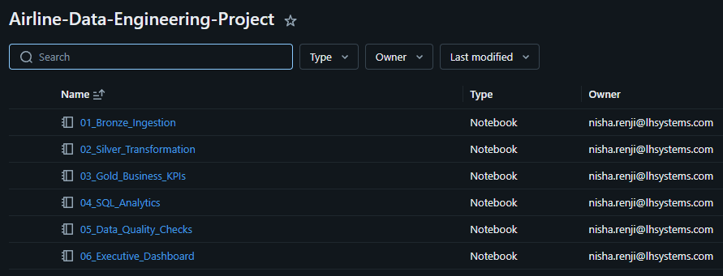
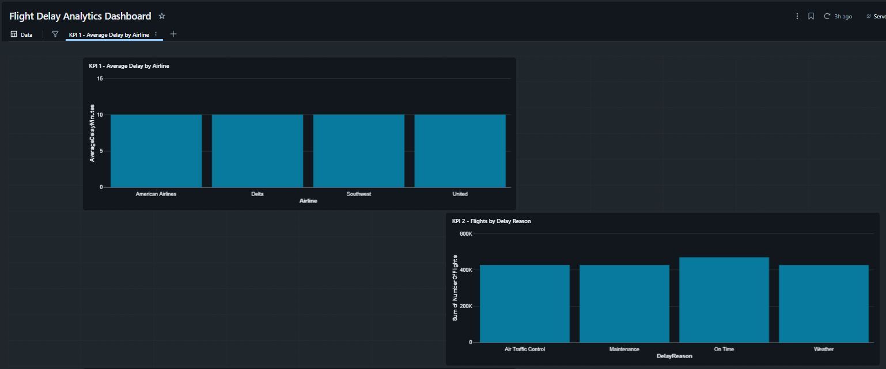
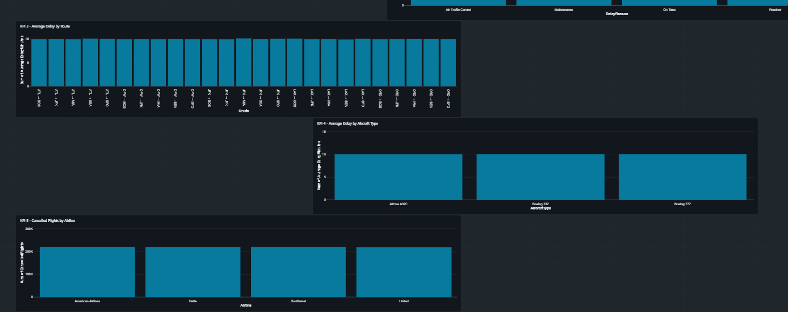
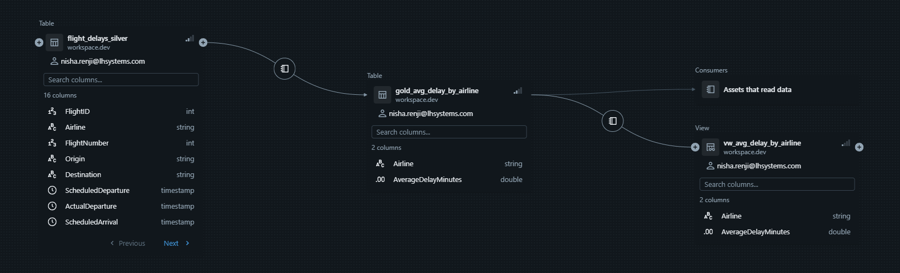

# Airline Data Engineering Project

An end-to-end Data Engineering project built using **Databricks, PySpark, Delta Lake, SQL, and Unity Catalog**, following the **Medallion Architecture (Bronze → Silver → Gold)**.

---

# Project Overview

This project demonstrates a complete Data Engineering pipeline that:

- Ingests raw airline flight data into Databricks
- Implements the Medallion Architecture (Bronze, Silver, Gold)
- Cleans and validates data using PySpark
- Generates business-ready KPI tables
- Performs analytical reporting using SQL
- Builds an Executive Dashboard
- Tracks end-to-end data lineage using Unity Catalog

---

# Architecture

```
                     Flight Delay CSV
                            │
                            ▼
                  01_Bronze_Ingestion
                            │
                            ▼
                  Bronze Delta Table
                            │
                            ▼
               02_Silver_Transformation
                            │
                            ▼
                  Silver Delta Table
                            │
                            ▼
               03_Gold_Business_KPIs
                            │
     ┌────────────┬────────────┬────────────┬────────────┬────────────┐
     ▼            ▼            ▼            ▼            ▼
 Airline KPI   Route KPI  Delay Reason  Aircraft KPI  Cancellation KPI
                            │
                            ▼
                  04_SQL_Analytics
                            │
                            ▼
             05_Data_Quality_Checks
                            │
                            ▼
              06_Executive_Dashboard
```

---

# Medallion Architecture

## Bronze Layer

- Read raw CSV data
- Store raw data in Delta format

## Silver Layer

- Remove duplicates
- Validate records
- Standardize data
- Prepare clean datasets

## Gold Layer

Generate business-ready analytical tables for reporting and dashboards.

---

# Technologies Used

- Databricks
- Apache Spark
- PySpark
- Spark SQL
- Delta Lake
- Unity Catalog
- Databricks SQL Dashboard
- GitHub

---

# Project Structure

```
Airline-Data-Engineering-Project
│
├── README.md
│
├── notebooks
│   ├── 01_Bronze_Ingestion.dbc
│   ├── 02_Silver_Transformation.dbc
│   ├── 03_Gold_Business_KPIs.dbc
│   ├── 04_SQL_Analytics.dbc
│   ├── 05_Data_Quality_Checks.dbc
│   └── 06_Executive_Dashboard.dbc
│
└── screenshots
```

---

# Databricks Workspace

The project is organized into separate notebooks representing each stage of the ETL pipeline.



---

# Executive Dashboard

The dashboard provides business insights generated from the Gold layer.

### Dashboard (Part 1)



### Dashboard (Part 2)



---

# Unity Catalog Lineage

The project uses Unity Catalog to track data lineage across the Medallion Architecture.



---

# Business KPIs

The project generates the following KPIs:

- Average Delay by Airline
- Flights by Delay Reason
- Average Delay by Route
- Average Delay by Aircraft Type
- Cancelled Flights by Airline

---

# Data Quality Checks

Implemented validations include:

- Duplicate record detection
- Null value validation
- Invalid route detection
- Distance validation
- Delay value validation

---

# Skills Demonstrated

- End-to-End ETL Pipeline Development
- Medallion Architecture
- PySpark Transformations
- Spark SQL
- Delta Lake
- Data Quality Validation
- Dashboard Development
- Unity Catalog
- Data Lineage
- Git Version Control

---

# Future Enhancements

- Streaming ingestion with Auto Loader
- Incremental processing
- Databricks Workflows orchestration
- CI/CD deployment
- Machine Learning-based delay prediction
